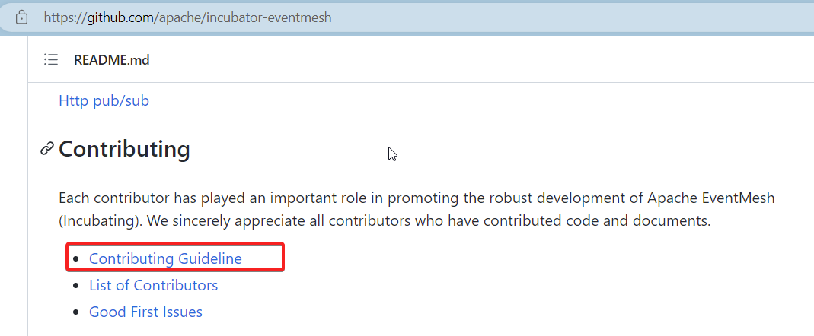
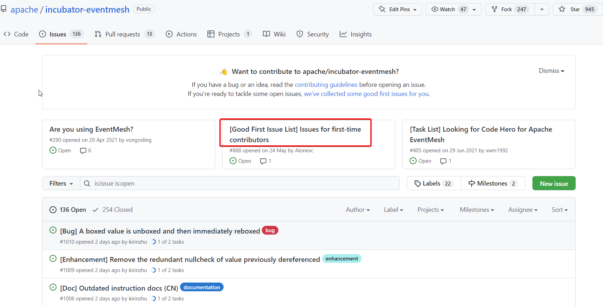
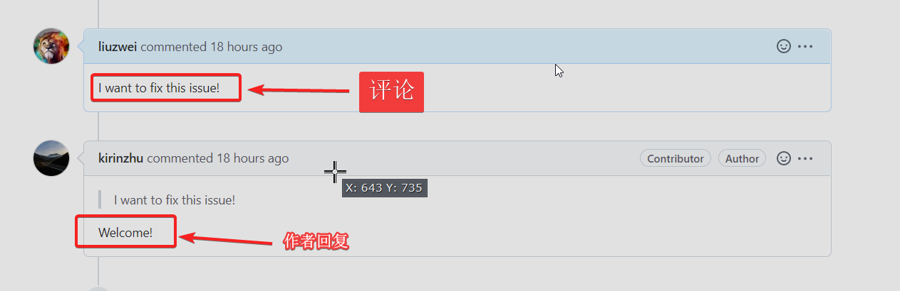
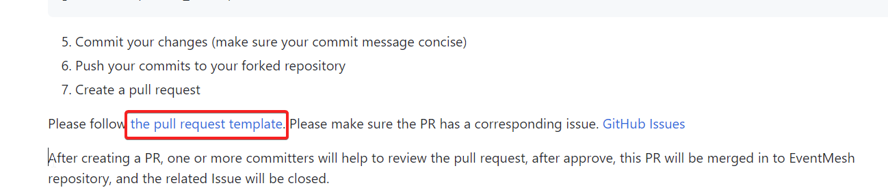

### 如何参与Apache开源项目

#### 1. 找到合适的（感兴趣）项目
> Apache有很多项目，有很多成熟的项目，也有很多孵化项目，对新手来说，当然是孵化项目更容易参与。
> 因为孵化项目参与的人不多，并且存在很多规范或是代码问题，并且有很多新手指引，找到相应的项目就可以开始参与了！

可以在Apache的官网找到相关孵化项目： https://incubator.apache.org/


#### 2. Github提交代码

##### 2.1找到新手指南，设置环境

每个项目都会有新手指引，告诉你如何贡献代码。

举个例子：[incubator-eventmesh](https://github.com/apache/incubator-eventmesh) 是Apache的一个孵化项目，一般孵化项目都以`incubator`开头。

一般会在介绍的首页下面会找到代码贡献指南


代码贡献指南中会介绍相关的代码Fork流程和代码提交流程，按照指南中的操作进行即可。

**提醒一点：**

fork项目，然后更新项目后要设置一下自己的Github用户名和密码，要和Github的用户名保持一致。
一般在仓库目录
```shell
# 查看用户名
git config user.name
# 查看邮箱
git config user.email

# 设置用户名, 这个用户名设置成Github上的用户名
git config user.name "liuzwei"
# 设置邮箱
git config user.email "liuzhaowei.cool@163.com"

```

新手指南中一般会介绍相关代码规范，或是License之类的基础环境配置，按照流程操作即可。

##### 2.2 找到适合自己的问题
环境设置好后就开始找一个感兴趣的问题开始编码。开源项目都会通过ISSUE来驱动问题的解决，比如是新特性或是Bug.在ISSUE列表中找问题。

项目中会列出一些适合第一次贡献的问题，这些问题一般都是挺简单的，主要是熟悉一下代码提交的流程，参与到项目中。
找到合适的问题后，在相关的ISSUE下评论，


当作者回复后就可以修改问题了。


##### 2.3 提交代码和PR

Bug修复完后提交代码，然后在Fork的仓库中创建PR.创建PR后也会有相关的操作说明，按照说明操作即可。


提交了PR后等待相关作者审核即可。
