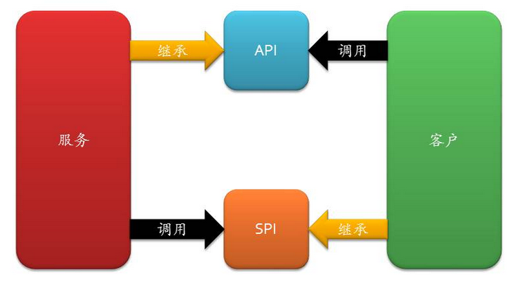

### 理解Java的SPI机制

#### 1.什么是SPI
在了解SPI(Service Provider Interface)之前，可能需要先了解一下API(Application Programming API)，
API我们再熟悉不过了。API的形式有各种各样，在Spring中Feign调用需要API接口，Dubbo中的调用也需要API接口，
这些接口的实现都在服务提供方。

是JDK内置的一种 服务提供发现机制，可以用来启用框架扩展和替换组件，主要是被框架的开发人员使用，
比如java.sql.Driver接口，其他不同厂商可以针对同一接口做出不同的实现，MySQL和PostgreSQL都有不同的实现提供给用户，
而Java的SPI机制可以为某个接口寻找服务实现。Java中SPI机制主要思想是将装配的控制权移到程序之外，在模块化设计中这个机制尤其重要，
其核心思想就是 解耦。



### 2.SPI实践

`spi-test`是一个服务模块，`spi-sdk`定义了一些接口，而`spi-database`和`spi-file`是对`spi-sdk`接口的实现。
当应用调用`spi-sdk`接口时会有多种实现方式。


根据SPI的机制，是接口实现模块`spi-database`和`spi-file`模块中需要增加一些配置。
在`resources`目录下增加文件夹`META-INF.services`并创建一个以`spi-sdk`中接口全限定名命名的文件，例如`com.challenge.arts.week29.spi.SpiSearch`,且在文件中添加接口具体实现的类限定名
```bash
com.challenge.arts.week29.spi.database.DatabaseSearchService
```

`spi-test`模块的使用：

```java
ServiceLoader<SpiSearch> searches = ServiceLoader.load(SpiSearch.class);

        Iterator<SpiSearch> iterator = searches.iterator();
        while (iterator.hasNext()){
            SpiSearch search = iterator.next();
            search.searchDocs("Java");
        }
```


