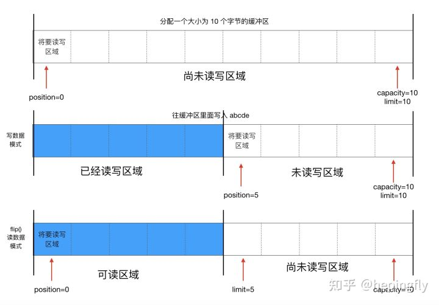

## ByteBuffer

**Buffer** : 一个用于特定基本数据类型的容器。由`java.nio`包定义。所有缓冲区都是Buffer抽象类的子类。

**Buffer Type** :

- ByteBuffer
- CharBuffer
- ShortBuffer
- IntBuffer
- LongBuffer
- FloatBuffer
- DoubleBuffer

**核心方法**

`put()`方法：存入数据到缓冲区。
`get()`方法：获取缓冲区的数据。

**核心属性**

- `capacity`: 容量，表示缓冲区中最大存储数据的容量。一旦声明不能更改。
- `limit`: 界限，表示缓冲区中可以操作数据的大小。（limit 后的数据不能进行读写）
- `position`: 位置，表示缓冲区中正在操作数据的位置。
- `mark`: 标记，表示记录当前 position 的位置。可以通过 reset() 恢复到 mark 的位置。

`0 <= mark <= position <= limit <= capacity`

