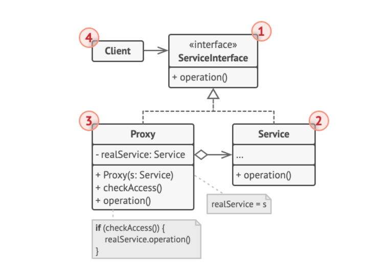

## 动态代理

如何理解动态代理，要先从理解静态代理说起。不论是动态代理还是静态代理都是代理模式的一种实现，那先看一下代理模式：

**代理**是一种结构型设计模式，让你能够提供对象的替代品或其占位符。代理控制着对于原对象的访问，并允许在将请求提交给对象前后进行一些处理。



1). **服务接口** （Service Interface） 声明了服务接口。 代理必须遵循该接口才能伪装成服务对象。

2). **服务** （Service） 类提供了一些实用的业务逻辑。

3). **代理** （Proxy） 类包含一个指向服务对象的引用成员变量。 代理完成其任务 （例如延迟初始化、 记录日志、 访问控制和缓存等） 后会将请求传递给服务对象。
通常情况下， 代理会对其服务对象的整个生命周期进行管理。

4). **客户端** （Client） 能通过同一接口与服务或代理进行交互， 所以你可在一切需要服务对象的代码中使用代理。

### 1. 静态代理示例

**定义一个计算器接口**
```java
/**
 * 计算器接口
 */
public interface Calculator {
    /**
     * 加法
     * @param a
     * @param b
     * @return
     */
    @Deprecated
    int add(int a, int b);

    /**
     * 乘法
     * @param a
     * @param b
     * @return
     */
    int multi(int a, int b);
}
```

**有一个计算器接口的具体实现**
```java
/**
 * 计算器实现
 */
public class CalculatorImpl implements Calculator{
    @Override
    public int add(int a, int b) {
        int c = a + b;
        System.out.printf("add %d + %d = %d \n", a, b, c);
        return c;
    }

    @Override
    public int multi(int a, int b) {
        int c = a * b;
        System.out.printf("multi %d * %d = %d \n", a, b, c);
        return c;
    }
}
```

**现在有这么个需求，在调用计算器的实现接口前，要打印一个日志，说明调了哪个接口**

直接改`CalculatorImpl`中的方法是最简单的，增加一个打印日志即可，但是这样会违反开闭原则，降低代码稳定性。
用静态代理的方法就是，新建一个静态代理类，同样也实现计算器接口的方法，并引用一个计算器实现的变量，代理类控制计算器实现类。

**创建计算器代理**
```java
public class CalculatorProxy  implements Calculator{

    private final CalculatorImpl calculator;

    public CalculatorProxy(CalculatorImpl calculator) {
        this.calculator = calculator;
    }

    @Override
    public int add(int a, int b) {
        System.out.println("execute add method");
        return calculator.add(a, b);
    }

    @Override
    public int multi(int a, int b) {
        System.out.println("execute multi method");
        return calculator.multi(a, b);
    }
}
```

**测试方法**
```java
public static void main(String[] args) {
        CalculatorProxy calculatorProxy = new CalculatorProxy(new CalculatorImpl());
        calculatorProxy.add(1 , 2);
        calculatorProxy.multi(10, 20);
    }
```
控制台：
```java
 execute add method 
 add 1 + 2 = 3
 execute multi method
 multi 10 * 20 = 200 
```

**参考文章**
`https://www.zhihu.com/question/20794107/answer/811250346`


--------

### 2. 动态代理示例
反射包提供了两个核心类，InvocationHandler和Proxy

动态代理，就是通过接口类的Class对象 + InvocationHandler接口 共同构造一个代理对象。

代理对象调用invoke方法，在invoke方法内可以实现一些特定的业务逻辑，比如说根据Method获取期注解等操作，实现一些其他功能等。
invoke方法再调用目标对象的方法。


**动态代理类**
```java
public class CalculatorDynamicProxyHandler implements InvocationHandler {
    private final Object target;

    public CalculatorDynamicProxyHandler(Object target) {
        this.target = target;
    }

    public Object invoke(Object proxy, Method method, Object[] args) throws Throwable {
        System.out.printf("invoke method = %s \n", method.getName());
        Object result = method.invoke(this.target, args);
        return result;
    }
}
```

**测试**

```java
public static void main(String[] args) throws Throwable {
        CalculatorImpl calculator = new CalculatorImpl();
        Calculator calculatorProxy = (Calculator) Proxy.newProxyInstance(
            calculator.getClass().getClassLoader(),
            calculator.getClass().getInterfaces(),
            new CalculatorDynamicProxyHandler(calculator));
        try {
            calculatorProxy.add(1,3);
        }catch (Exception e) {
            System.out.println("exception:"+ e.getMessage());
        }
        calculatorProxy.multi(10,30);
    }
```


