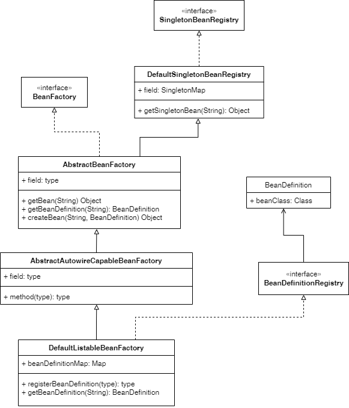

## 理解Spring Bean容器

Spring的使用步骤大致有三部分：

1.初始化BeanFactory

2.注册Bean的定义，即BeanDifinition

3.获取使用Bean.

可通过一个大致的类图理解一下Spring容器是如何存储的。

`BeanFactory`接口定义了`getBean()`方法，抽象类`AbstractBeanFactory`实现了接口`BeanFactory`并通过模板方法定义了Bean的加载流程，该模板方法是先从容器中获取需要的Bean获取不到则根据名字获取Bean定义，通过Bean定义创建Bean对象再返回。

该模板方法中定了两个抽象方法`getBeanDefinition()`和`createBean()`，由子类实现。

`SingletonBeanRegistry`接口定义了获取单例Bean接口，由`DefaultSingletonBeanRegistry`实现，该类通过一个Map结构来存储Bean对象。

`AbstractAutowireCapableBeanFactory`抽象类继承了`AbstractBeanFactory`并实现了其定义的抽象方法`createBean()`;

`DefaultListableBeanFactory`核心类继承了`AbstractAutowireCapableBeanFactory`并实现了`AbstractBeanFactory`定义的抽象方法`getBeanDefinition()`。同时又实现了接口`BeanDefinitionRegistry`，具有了注册BeanDefinition的能力。

