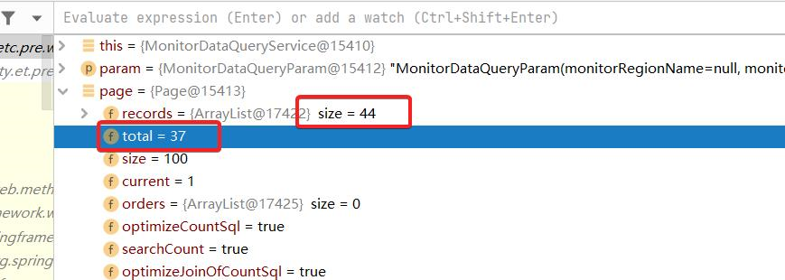

## Mybatisplus 分页插件统计Total问题

### 1. 问题背景

测试人员提了一个功能缺陷，一个分页展示页面，显示一共40条数据，但是有些数据没有，通过过滤筛选条件才能查询到。

测试人员就给提了一个缺陷，数据在列表找不到。

### 2. 问题排查
启动本地环境，进行调试，发现total和records的size不一致，蒙了，怎么会有这种幺蛾子。



然后看了一下XML里的SQL，放Navicat里查出来是44，通过分页插件count出来怎么就是37了呢？

经过多次调用，传的参数不一致，发现打印出来的统计count的SQL语句也有所不同。

最终通过查阅了一下资料发现，分页插件在做关联表的count计算时，有对sql进行优化，如果where条件中没有用到子表的信息，就只count主表了，
不会count整个查询语句。

禁用优化：

```java
    Page page = new Page<>(param.getCurrentPage(), param.getPageSize());
    // 不做优化处理
    page.setOptimizeCountSql(false);
```